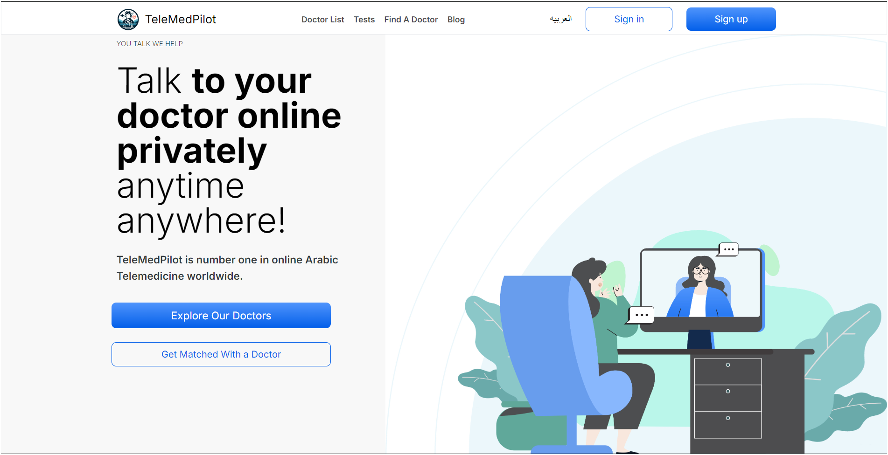

<div style="display: flex;flex-direction: row; align-items: center; justify-content: center;">
  
</div>

# HealHub

## **Your Virtual Healthcare Companion**

A modern telemedicine platform designed to connect patients with certified doctors via secure online consultations. HealHub simplifies healthcare by offering features such as video calls, appointment booking, AI-powered chat assistance, and medical record management, making healthcare more accessible and convenient.

---

## [Live Demo](https://healhub-your-deployment.vercel.app)
## [Video Demo](https://drive.google.com/file/d/your-video-id/view?usp=sharing)


> Home page showcasing the AI chat assistant and instant consultation booking.

## Features

- **AI Chat Assistant**: Intelligent healthcare support with instant responses to common medical queries and appointment booking guidance
- **Instant Video Consultations**: Seamless video consultations between doctors and patients with average wait time < 3 minutes
- **Doctor and Patient Signup**: Doctors can manage their availability, and patients can easily book appointments
- **24/7 Appointment Scheduling**: Round-the-clock availability with flexible scheduling options
- **Medical Records**: Patients have secure access to their prescriptions, test results, and visit history
- **HIPAA-Compliant Security**: End-to-end encryption and secure messaging for all medical communications
- **Multi-Specialty Care**: General Medicine, Dermatology, Mental Health, Pediatrics, and Women's Health

## **Why Choose HealHub?**

- **Lightning Fast**: Get care in under 3 minutes with our instant consultation feature
- **AI-Powered Support**: 24/7 intelligent chat assistant to guide you through your healthcare journey
- **Flexible Care Options**: Choose between video consultations, phone calls, or secure messaging
- **Doctor Search & Filters**: Find the right doctor based on specialty, experience, and availability
- **Personalized Treatment**: Get customized treatment plans and instant prescription delivery
- **Insurance Friendly**: Most major insurance plans accepted with transparent pricing
- **Mobile Responsive**: Access healthcare from any device, anywhere

---

## **How HealHub Works**

1. **Create an Account**: Quick signup and profile setup
2. **Choose Your Care**: Instant consultation or scheduled appointment
3. **AI Assistant Help**: Get guidance on symptoms, insurance, or booking
4. **Consult Securely**: Meet with board-certified doctors via secure video
5. **Receive Treatment**: Get diagnosis, prescriptions sent to your pharmacy
6. **Follow-up Care**: Access medical records and continued support

---

## **Live Demo**

Visit the live website: [HealHub](https://healhub-your-deployment.vercel.app)

---

## **Technology Stack**

- **Frontend**: Next.js 14 (with TypeScript)
- **Styling**: Tailwind CSS for responsive design
- **AI Chat**: Custom AI assistant with healthcare-specific responses
- **Authentication**: Secure user authentication and role-based access
- **Database**: MongoDB for scalable data management
- **Cloud Services**: AWS for hosting and secure data storage
- **Video Conferencing**: WebRTC for seamless online consultations
- **Security**: HIPAA-compliant encryption and data protection

---

## **Key Features & Components**

### **🤖 AI Chat Assistant**
- Intelligent healthcare query handling
- Appointment booking guidance
- Symptom checking and triage
- Insurance and billing support
- 24/7 availability with instant responses

### **📱 Responsive Design**
- Mobile-first approach
- Cross-device compatibility
- Optimized for tablets and desktops
- Touch-friendly interface

### **🔒 Security & Compliance**
- HIPAA-compliant data handling
- End-to-end encryption
- Secure video communications
- Protected health information (PHI) safeguards

---

## **Technologies Used (Frontend)**

- **Next.js 14 (TypeScript)**: Modern React framework with server-side rendering
- **Tailwind CSS**: Utility-first CSS framework for rapid UI development
- **Custom React Hooks**: Efficient state management and reusable logic
- **React Components**: Modular and maintainable component architecture
- **Git**: Version control and collaborative development
- **Responsive Design**: Mobile-first approach optimized for all devices

---

## **Learnings from This Project**

Building HealHub provided valuable insights into:

1. **Healthcare Technology Standards**:
   Understanding HIPAA compliance requirements and implementing secure data handling practices for sensitive medical information.

2. **AI Integration**:
   Developing an intelligent chat assistant that provides contextually relevant healthcare guidance while maintaining professional medical standards.

3. **Real-time Communication**:
   Implementing secure video conferencing and messaging systems optimized for healthcare consultations.

4. **User Experience Design**:
   Creating intuitive interfaces that work for diverse user groups, from tech-savvy millennials to less technical elderly patients.

5. **Performance Optimization**:
   Ensuring fast load times and smooth interactions, critical for urgent healthcare scenarios.

---

## **Acknowledgements**

Special thanks to the HealHub development team and the healthcare professionals who provided guidance on medical workflows and patient care standards. This project wouldn't have been possible without:

- **Frontend Development**: Advanced React/Next.js implementation with AI chat integration
- **Healthcare Consultation**: Medical professionals ensuring platform meets clinical standards
- **UI/UX Design**: Creating accessible and intuitive healthcare interfaces
- **Security Engineering**: Implementing HIPAA-compliant security measures
- **Quality Assurance**: Thorough testing for healthcare-critical applications

---

### **Installation for Developers**

1. **Clone the repository:**

   ```bash
   git clone https://github.com/MK-2206/HealHub-Revamp-main.git
   ```

2. **Navigate to the project directory:**

   ```bash
   cd HealHub-Revamp-main/telemedapp
   ```

3. **Install dependencies:**

   ```bash
   npm install
   ```

4. **Environment Setup:**

   Create a `.env.local` file and add necessary environment variables:
   ```env
   NEXT_PUBLIC_API_URL=your_api_url
   MONGODB_URI=your_mongodb_connection
   JWT_SECRET=your_jwt_secret
   ```

---

### **Running the App**

1. **Start Development Server:**

   ```bash
   npm run dev
   ```

2. **Build for Production:**

   ```bash
   npm run build
   ```

3. **Start Production Server:**

   ```bash
   npm start
   ```

---

### **HealHub Architecture**

#### **High-Level Overview**

HealHub is built on a modern, scalable architecture designed for healthcare applications:

- **Frontend**: Responsive Next.js application with TypeScript for type safety
- **AI Chat System**: Custom healthcare chatbot with intelligent response matching
- **Backend Services**: Node.js API gateway handling authentication, appointments, and medical records
- **Database**: MongoDB for efficient and secure storage of patient data
- **Video Infrastructure**: WebRTC implementation for low-latency medical consultations
- **Security Layer**: HIPAA-compliant encryption and access controls

---

### **Data Model Design**

HealHub follows healthcare industry standards for data organization:

- **Users (Patients, Doctors, Admins)**: Role-based access with secure profile management
- **Appointments**: Comprehensive booking system with availability tracking
- **Medical Records**: Encrypted storage of patient history, prescriptions, and test results
- **Chat Logs**: Secure storage of AI assistant interactions for continuity of care
- **Consultations**: Video session management with recording capabilities (where permitted)

---

### **Future Enhancements**

- **Mobile App**: Native iOS and Android applications
- **Advanced AI**: Machine learning for symptom analysis and care recommendations
- **Wearable Integration**: Apple Health and Google Fit connectivity
- **Prescription Delivery**: Pharmacy partnerships for medication delivery
- **Mental Health Tools**: Specialized mental health assessment and therapy features

---   

### **Endnote**

HealHub represents a modern approach to telemedicine, combining cutting-edge technology with human-centered healthcare design. This project demonstrates the potential of technology to make quality healthcare more accessible, efficient, and patient-friendly.

## **Contact Information**

- **Developer**: [Mansi Kharke](https://github.com/MK-2206)
- **Portfolio**: [mansikharke.netlify.app](https://mansikharke.netlify.app/)
- **Email**: [mansikh.work@gmail.com](mailto:mansikh.work@gmail.com)
- **LinkedIn**: [Mansi Kharke](https://www.linkedin.com/in/mansi-kharke-3b7565183/)

---

## **License**

This project is licensed under the MIT License - see the [LICENSE](LICENSE) file for details.

---

**Built with ❤️ for better healthcare accessibility**
